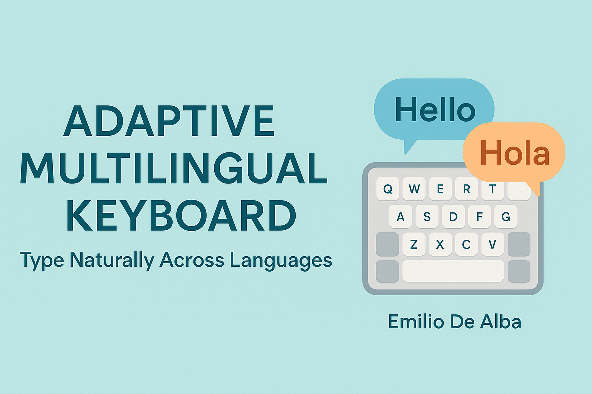

  

# adaptive-multilingual-keyboard
Concept by Emilio De Alba — An intelligent keyboard that automatically detects and adapts to the language being typed.

  
  
  

<h1 align="center"> Adaptive Multilingual Keyboard</h1>

  <i>Concept by <b>Emilio De Alba</b> — November 2025</i> 
  <b>A smart keyboard that automatically detects and adapts to the language you're typing.</b>

---

Adaptive Multilingual Keyboard

Concept by Emilio De Alba – November 2025

💡 Overview

Typing in multiple languages is a daily struggle for bilingual and multilingual users.
Current smartphone keyboards require manual switching or fail to handle mixed-language sentences gracefully.

This project introduces a smart keyboard that automatically detects the language you’re typing and adapts instantly — no switching needed.

🔍 Problem

Constant manual switching between keyboards.

Incorrect autocorrections when using mixed languages.

Poor user experience for international users, students, and travelers.

💡 Solution

The Adaptive Multilingual Keyboard uses lightweight on-device AI to:

Detect the current typing language in real time.

Switch word predictions, autocorrect, and layout dynamically.

Support true code-switching (e.g., “Hola dude, cómo estás?”).

Operate fully offline for privacy and speed.

⚙️ Technical Concept

Token-level language detection using a compact ML model (fastText or DistilBERT).

Context-aware adaptation at the phrase level.

Federated learning for personalization without sharing private data.

Modular structure for Android InputMethodService integration.

🔒 Privacy

100% local processing by default.

GDPR-compliant design.

No cloud uploads unless the user opts in.

🌍 Target Users

Multilingual professionals, students, and travelers.

People who switch between languages daily.

🚀 Next Steps

Build a prototype using Android’s InputMethodService.

Train or fine-tune a lightweight multilingual model for detection.

Publish alpha for testers.

Seek partnerships or open collaboration.

✍️ Authored by Emilio De Alba
📅 Published November 2025
🔗 Feel free to share or collaborate with credit.

🤝 Collaboration

Interested in helping build this?
Feel free to open an Issue, start a Discussion, or contact me on LinkedIn
https://www.linkedin.com/in/emilio-gabriel-de-alba-aguado-610a59132/?skipRedirect=true
.
